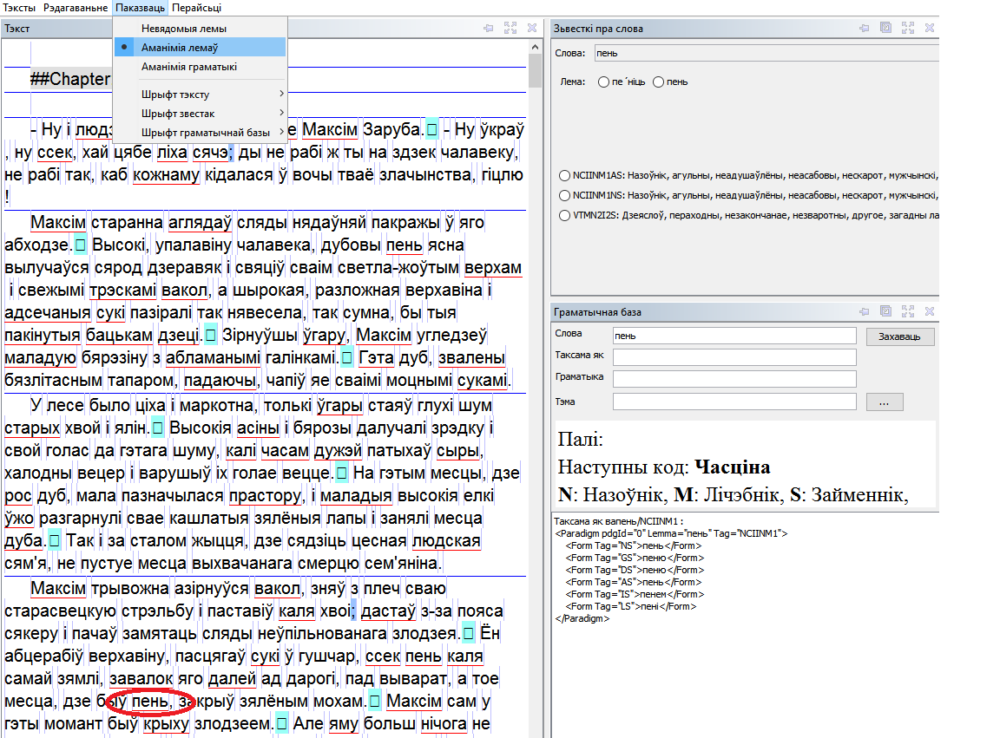
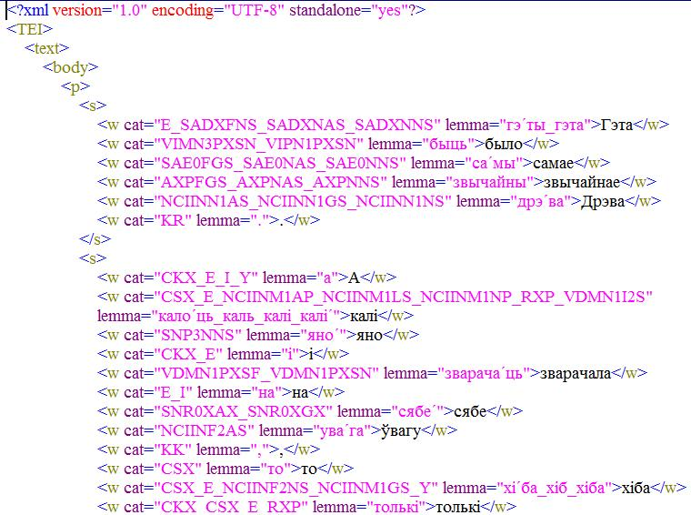
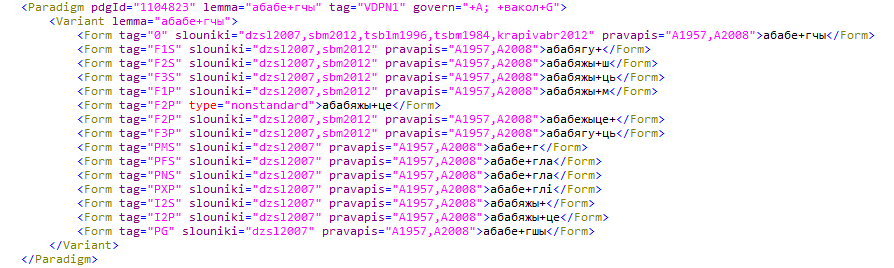
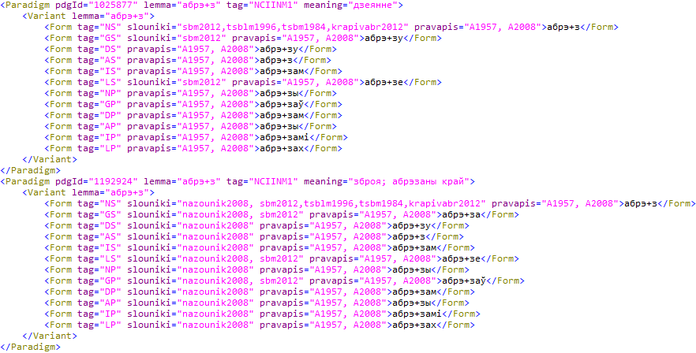
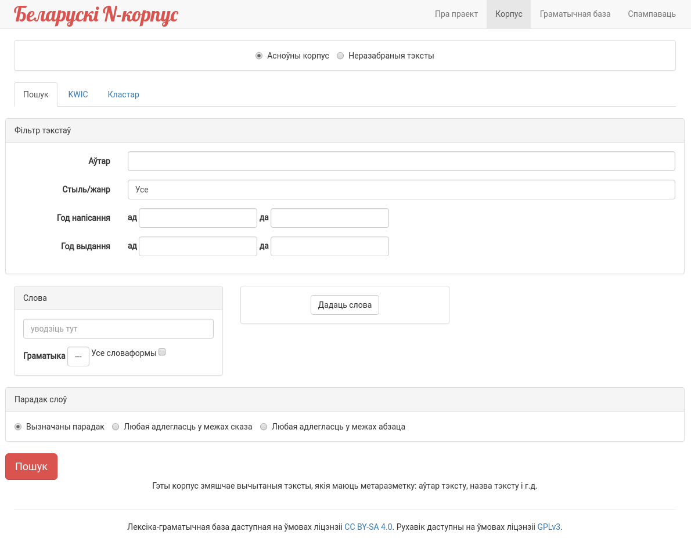

**Уладзімір Кошчанка**

_Цэнтр даследаванняў беларускай культуры, мовы і літаратуры Нацыянальнай акадэміі навук Беларусі, Беларусь, Мінск_

>У дакладзе раскрываецца гісторыя стварэння Беларускага N-корпусу, прататыпа Нацыянальнага корпусу беларускай мовы, у кантэксце корпуснай лінгвістыкі славянскіх краін, апісваюцца этапы яго ўкладання: выяўленне нацыянальнай спецыфікі вызначэння моўнай рэпрэзентатыўнасці, распрацоўка прынцыпаў пабудовы корпуса, укладанне лексіка-граматычнай базы беларускай мовы для граматычнай разметкі, стварэнне праграмнага забеспячэння.

>Нацыянальны корпус беларускай мовы, Беларускі N-корпус, Corpus Albaruthenicum, корпус паралельных тэкстаў, лексіка-граматычная база, рэпрэзентатыўнасць, метатэкставая разметка

>The report reveals the history of the Belarusian N-korpus, the prototype of the National Corpus of the Belarusian Language, creation in the context of Slavic countries corpus linguistics. It describes the stages of its development: the national specificity of language representativeness determination, the Corpus building principles development, the Lexical and Grammatical Database of the Belarusian Language creation, specific software development.

>National Corpus of the Belarusian Language, Belarusian N-korpus, Corpus Albaruthenicum, parallel corpus, lexical and grammatical database, representativeness, metadata

# Нацыянальны корпус беларускай мовы ў кантэксце корпуснай лінгвістыкі славянскіх краін

Даследаванні беларускай мовы пры дапамозе камп’ютараў маюць даволі працяглую гісторыю: у канцы 1970-х па ініцыятыве В.У. Мартынава ў Інстытуце мовазнаўства Акадэміі навук БССР была распачата праца па аўтаматызацыі лінгвістычных даследаванняў, адным з кірункаў якой было стварэнне канкардансаў беларускай мовы. Ужо тады было разуменне, што папяровыя картатэкі – гэта неэфектыўны інструмент для даследаванняў. З таго часу і па сённяшні дзень быў створаны шэраг канкардансаў: Канкарданс беларускай мовы ХІХ стагоддзя, Канкарданс твораў Кандрата Крапівы, Канкарданс твораў Кузьмы Чонага (быў страчаны). Пазней праца ў гэтым кірунку была фактычна згорнута і толькі ў апошнія гады аднавілася [СЯНКЕВІЧ 2017].

Што тычыцца ўласна корпуснай лінгвістыкі, то ў Беларусі было некалькі праектаў па стварэнні корпусаў. У рамках дзяржаўнай праграмы “Электронная Беларусь” была запланавана распрацоўка камп’ютарнага фонду беларускай мовы, у тым ліку інфармацыйнай сістэмы “Машынны фонд беларускай мовы” (праграма завяршылася ў 2005 г), у выніку быў створаны паралельны руска-беларускі корпус юрыдычных тэкстаў аб’ёмам каля 1 млн. словаўжыванняў [РУБАШКО 2006].

У 2001 г. у Гродзенскім дзяржаўным універсітэце ў рамках праграмы даследаванняў Фонда фундаментальных даследаванняў выконвалася тэма «Комплексное исследование морфологических особенностей языка драматургических произведений Янки Купалы (на материале специальных текстовых баз данных)» пад кіраўніцтвам Л.В. Рычковай. У рамках праекта быў створаны корпус твораў Янкі Купалы [РЫЧКОВА 1999].

У 2001 г. у Інстытуце мовазнаўства імя Якуба Коласа Нацыянальнай акадэміі навук Беларусі была зацверджана дзяржаўная праграма фундаментальных навуковых даследаванняў і адным з заданняў гэтай праграмы стала “*Праблема моўнай рэпрэзентатыўнасці і прынцыпы пабудовы корпусу беларускай мовы*”. Заданне выконвалася аддзелам славянскага і тэарэтычнага мовазнаўства Інстытута мовазнаўства Нацыянальнай акадэміі навук Беларусі і аддзелам навуковай тэрміналогіі Навукова-асветніцкага цэнтра імя Францішка Скарыны пры Мінскім дзяржаўным педагагічным універсітэце. Кіраўніком тэмы з’яўляўся прафесар Генадзь Цыхун. Пры асэнсаванні праблемы рэпрэзентатыўнасці тэкстаў беларускай мовы асаблівая ўвага звярталася на вызначэнне і выбар агульных крытэрыяў адбору найбольш прадстаўнічых тэкстаў з розных галін яе функцыянавання. У выніку даследавання былі вызначаны: *жанравая рэпрэзентатыўнасць, храналагічна-гістарычная рэпрэзентатыўнасць, геаграфічная рэпрэзентатыўнасць, варыянтна-правапісная рэпрэзентатыўнасць*. На падставе распрацаваных крытэрыяў рэпрэзентатыўнасці беларускай мовы быў зроблены адбор тэкставых матэрыялаў, у тым ліку для ўключэння ў падкорпус «Спецыяльныя тэксты» (блок спецыяльных тэкстаў, што рэпрэзентуюць асноўныя галіны беларускамоўнай навукі, грамадскага жыцця, прафесійнай дзейнасці і сацыяльна маркіраваных асяродкаў (моладзевых, групавых і г.д.).

Дадаткова вялася праца па распрацоўцы стандарта і прынцыпаў структурнага анатавання (разметкі) тэкстаў, у выніку чаго былі выяўлены і вырашаны многія праблемныя моманты.

Быў таксама праведзены «круглы стол» на тэму «Праблемы рэпрэзентатыўнасці і стварэнне *Корпусу беларускай мовы*» з удзелам зацікаўленых устаноў і арганізацый (Інстытут мовазнаўства НАН Беларусі, БДУ, ТБМ, Гродзенскі дзяржаўны ўніверсітэт), дзе былі абмеркаваны прынцыповыя пытанні па стварэнні *Нацыянальнага корпусу беларускай мовы* і ўдакладнены некаторыя аспекты працы над ім.

У 2005 г. скончыўся тэрмін выканання дзяржаўнай праграмы, а ў 2006 г. пачалася новая дзяржаўная праграма на 2006–2010 гг., у якой корпус быў прадстаўлены заданнем “*Стварэнне корпусу тэкстаў беларускай мовы і яго выкарыстанне для вывучэння беларускай мовы і яе сувязей з мовамі Еўропы*”. Заданне выконвалася ў Мінскім дзяржаўным лінгвістычным універсітэце пад кіраўніцтвам прафесара Аляксандра Зубава, загадчыка кафедры інфарматыкі і прыкладной лінгвістыкі, і з’яўлялася працягам папярэдняга задання, якое распрацоўвалася ў Інстытуце мовазнаўства НАН Беларусі. Пры змене выканаўцаў задання была захавана пераемнасць (у тым ліку кадравая), і за аснову *Корпусу беларускай мовы* былі ўзяты напрацоўкі папярэдняга этапу. На гэтым этапе адпрацоўвалася сістэма граматычнай і структурнай разметкі, пашыралася граматычная база.

У выніку выканання задання быў створаны аднамоўны корпус аб’ёмам 1 млн. словаўжыванняў, паралельны англа-беларускі корпус тэкстаў, а таксама нямецка-беларускі корпус тэкстаў, кожны аб’ёмам 300 тыс. словаўжыванняў. Корпусы, створаныя ў межах задання, не з’яўляюцца публічнымі [ЗУБОВ 2006].

У 2005 годзе пачаўся міжнародны праект “BalticGrid”, мэтай якога была распрацоўка грыд-сеткі для краін Балтыі і ўсталяванне ўстойлівай э-інфраструктуры з мэтай выкарыстання ў розных навуковых даследаваннях Еўропы і далучэння яе да агульнаеўрапейскай э-інфраструктуры. З 2008 года ў межах 7-ай рамкавай праграмы Еўрапейскага саюзу ажыццяўляўся міжнародны праект “BalticGrid-II”, які стаў працягам праекта “BalticGrid”. Мэтай праекта “BalticGrid-II” было пашырэнне і развіццё існай інфраструктуры і пераўтварэнне яе ў штодзённы інструмент працы для вучоных рэгіёна і па-за яго межамі. Пры гэтым поўнамаштабная рэалізацыя праекта прадугледжвала пашырэнне інфраструктуры “BalticGrid” на Беларусь з улікам патрэб новадалучаных беларускіх навуковых супольнасцей, якія займаюцца нанатэхналогіямі, машынабудаваннем і г.д.

Адным з кірункаў у праекце “ВаlticGrid-II” была распрацоўка лінгвістычных рэсурсаў для краін Балтыі і Беларусі. У прыватнасці, Літва (Вільнюскі ўніверсітэт) і Беларусь (Беларускі нацыянальны тэхнічны ўніверсітэт – навукова-даследчая лабараторыя дынамікі сістэм і механікі матэрыялаў пры ўдзеле спецыялістаў з Інстытута мовы і літаратуры імя Якуба Коласа і Янкі Купалы НАН Беларусі) распрацоўвалі тэкставыя корпусы навуковай мовы, адпаведна літоўскай і беларускай.

У выніку быў створаны аднамоўны корпус навуковых тэкстаў беларускай мовы **Corpus Albaruthenicum** аб’ёмам 350 тыс. словаўжыванняў (са знятай аманіміяй), які даступны па адрасе: *http://grid.bntu.by/corpus/* [КОШЧАНКА 2009].

У 2011–2013 гг. калектыў, які складаўся з супрацоўнікаў Інстытута мовы і літаратуры імя Якуба Коласа і Янкі Купалы НАН Беларусі (цяпер філіял Цэнтра даследаванняў беларускай культуры, мовы і літаратуры НАН Беларусі), Мінскага лінгвістычнага ўніверсітэта і Інстытута рускай мовы імя В.У. Вінаградава РАН ажыццявіў сумесны праект па стварэнні паралельных беларуска-рускага і руска-беларускага корпусаў пры падтрымцы Беларускага рэспубліканскага фонда фундаментальных даследаванняў.

**Беларуска-рускі, руска-беларускі корпус паралельных тэкстаў**, аб’ём якога складае каля 3 млн. словаўжыванняў, даступны на сайце Нацыянальнага корпусу рускай мовы (*http://ruscorpora.ru/search-para-be.html*) [СИЧИНАВА 2012; КОШЧАНКА 2013].

Такім чынам, папярэдне была праведзена праца, якая дазволіла вырашыць многія пытанні тэарэтычнага і практычнага характару, якія тычыліся стварэння аднамоўнага Нацыянальнага корпусу. Стварэнне нацыянальнага корпусу было жыццёва неабходным. Так, перад Інстытутам мовазнаўства стаіць складаная і адказная задача па ўкладанні новага фундаментальнага акадэмічнага тлумачальнага слоўніка. Аднак рэалізацыя такога слоўніка не ўяўляецца магчымай без стварэння вялікага корпусу, які б уключаў у сябе тэксты рознай стылёвай і жанравай прыналежнасці і ахопліваў усе перыяды новай беларускай літаратурнай мовы.

У пытанні стварэння Нацыянальнага корпусу Беларусь адставала ад многіх славянскіх краін: к 2015 году ўжо былі створаны нацыянальныя корпусы ці іх аналагі чэшскай мовы (2000 г.) [ČNK], славацкай (2002 г.)[ SNK], польскай (2008 г.) [NKJP], рускай (2004 г.) [НКРЯ], балгарскай (2001г.) [БНК], харвацкай (1998 г.) [HNK] і інш.

## Да Нацыянальнага корпусу беларускай мовы

Вышэйапісаныя беларускія корпусныя даследаванні не выходзілі на інтэгральны ўзровень Нацыянальнага корпусу. Толькі з 2015 года пачалася праца над стварэннем уласна Нацыянальнага корпусу, калі быў зацверджаны асобны праект на 2015-2016 гг. “Стварэнне Нацыянальнага корпусу і лексіка-граматычнай базы беларускай мовы і іх праграмнае суправаджэнне”, што выконваўся ў Інстытуце мовазнаўства імя Якуба Коласа НАН Беларусі.

## Стандарт Нацыянальнага корпусу беларускай мовы

Пасля аналізу існуючых стандартаў стварэння тэкставых корпусаў (CES (Corpus Encoding Standard), XCES (Corpus Encoding Standard for XML), ISLE (International Standards for Language Engineering), CDIF (Corpus Document Interchange Format, BNC), для стварэння Нацыянальнага корпусу беларускай мовы было прынята рашэнне адмовіцца ад пэўнага канкрэтнага стандарту і ствараць корпус на аснове XML з элементамі XCES.

Стандарт XCES спраектаваны для захоўвання корпусаў, што з'яўляюцца рэсурсам для прыкладной лінгвістыкі, машыннага перакладу, лексікаграфіі і г. д. [XCES]

Стандарт Нацыянальнага корпусу беларускай мовы (СНКБМ) адрознівае першасныя звесткі, &quot;неанатаваныя&quot; звесткі ў электроннай форме, якія часта ствараюцца для нелінгвістычных мэтаў, і лінгвістычную анатацыю, якая ўтрымлівае інфармацыю, згенераваную і далучаную да першасных звестак у выніку пэўнага лінгвістычнага аналізу. СНКБМ ахоплівае кадзіроўку аб'ектаў першасных звестак, якія з’яўляюцца рэлевантнымі для лінгвістычнага даследавання і ў такіх раздзелах як:

– вялікія часткі дыскурсу, такія, як абзацы, главы і г. д. (разам з загалоўкамі, спасылкамі і пад.).

– элементы абзаца, якія ўяўляюць інтарэс для лінгвістычнага аналізу, такія, як сказы, цытаты ў простай мове, уласныя імёны, даты, скарачэнні, тэрміны і г. д.

СНКБМ таксама ахоплівае ўзгодненыя кадзіроўкі для лінгвістычнай анатацыі тэксту і маўлення, уключна з морфа-сінтаксічным анатаваннем, паралельным змяшчэннем тэкстаў і г.д.

## Тытул тэксту і пашпартызацыя

Пашпартызацыя (метаразметка) Беларускага N-корпусу пакуль даступная ў даволі абмежаваным выглядзе, але рыхтуецца новая версія корпусу і карыстальнікі будуць мець магчымасць атрымаць поўнае апісанне тэкстаў.

Метаразметка Беларускага N-корпусу адрозніваецца ад іншых славянскіх корпусаў нязначна і мае стандартны набор характарыстык. У структуру анатаванага (размечанага) тэксту эксперыментальнага корпусу уваходзіць *тытул тэксту* і кадзіраванне *першасных звестак*. Кожны дакумент корпусу мае свой тытул пад назвай “*тытул тэксту*”. *Тытул тэксту* складаецца з апісання структуры дакумента (апісанне файла, заяўленне загалоўка, выдання і аб’ёму, апісанне крыніцы і інш.), апісання кадзіроўкі (аб’яўленне тэгаў у тэксце, прынцып сегментацыі тэксту і інш.), апісання параметраў (паходжанне тэксту, мова, раскладка знакаў і інш.). Такім чынам, *тытул тэксту* змяшчае ўсе параметры тэксту, якому ён папярэднічае.

Схематычна *Тытул тэксту* выглядае наступным чынам:

*&lt;тытул&gt;*

*1) бібліяграфічнае апісанне*

*назва твора*

*аўтар (або аўтар раздзела) *

*месца публікацыі*

*выданне, з якога алічбоўваўся тэкст*

*выдавецтва*

*год выдання *

*год першага выдання *

*год стварэння*

*дадатковыя заўвагі*

*2) стылістычнае апісанне*

*стыль*

*жанр*

*3) іншая інфармацыя*

*пазначэнне правапісу *

*дадатковае апісанне*

Дакладнае і ўсебаковае апісанне тэкстаў павінна ахопліваць і падыходзіць да ўсіх, без выключэння, тэкстаў, якія змешчаны ў Корпусе (а яны самыя розных па стылях, тыпах, жанрах і г. д.), гэта значыць – быць уніфікаваным.

Такім чынам, кожны тэкст, які ўваходзіць у Корпус падпадае пад пашпартызацыю – гэта значыць, наданне яму максімальна поўнага бібліяграфічнага апісання. Агульнымі асноўнымі ўласцівасцямі пашпартоў тэксту лічацца з аднаго боку, інфарматыўнасць, з другога – кампактнасць, Яны даюць найбольш поўнае ўяўленне пра аб’ект за кароткі тэрмін, што асабліва актуальна ў сучасных умовах.

У выніку даследавання і аналізавання розных схем і прынцыпаў напаўнення пашпартоў тэксту корпусаў, а таксама з улікам нацыянальнай спецыфікі функцыянавання тэкстаў, распрацаваны наступныя пазіцыі для пашпартызацыі, якія вызначаны як найбольш істотныя:

1. Аўтары / Authors (адзін ці некалькі аўтараў; тут таксама азначана праблема ананімных твораў і твораў, аўтарства якіх аспрэчваецца ці не даказана).

1. Назва / Title (адлюстраваны выпадкі змены назваў, яе адсутнасці, асабліва ў творах малых вершаваных форм).

1. Выданне, з якога алічбаваны тэкст / Edition

1. Месца, год выдання, выдавецтва / Source (у тэкстах, што друкаваліся ў дакастрычніцкі ці даваенны перыяд адна пазіцыя можа адсутнічаць).

1. Стыль, жанр / Style Genre (азначана праблема розных падыходаў да класіфікацыі жанраў і стыляў).

1. Гады стварэння / Creation Years (дата можа быць пашыранай: *1 жніўня 1989 — 26 мая 1990 г.;* працяглай у часе: *15 сакавіка 1954 — 8 кастрычніка 1957 г.*, *студзень 1962 — 12 верасня 1967 г.*,* *асабліва гэта датычыць занатаваных дат у аўтографах і машынапісах, калі яны захаваліся)

1. Год выдання / Publication Year.

1. Год першага выдання / FirstPublicationYear

1. Кароткае дадатковае апісанне / Description (месца і дата, першай публікацыі пры выпадках перавыдання; рэдактары; наяўнасць ілюстрацый; колькасць старонак; бібліяграфія).

Дадаткова была распрацавана праграма, якая дазваляе ў паўаўтаматычным рэжыме ствараць пашпарт тэксту:

У выніку, у файл дадаецца інфармацыя наступнага кшталту:

> \##Authors: Альгерд Абуховіч

> \##Title: Старшына

> \##SectionsTheme: Паэзія

> \##Description: упершыню апублікаваны ў Беларускі календар «Нашай нівы» на 1915 г. − Вільня, 1915

> \##Edition: Беларуская літаратура : Хрэстаматыя. Частка другая. (Другая палова ХІХ ст.) Дапаможнік для польскіх студэнтаў па спецыяльнасці “Беларуская філалогія” / Уклад. і камент. М. Хаўстовіча. Мн., 2006. − 204 с

> \##StyleGenre: мастацкі/басня

> \##CreationYear: 1914?

> \##PublicationYear: 2006

> \##FirstPublicationYear: 1915

> \####Параметры тып тэксту, жанр і стыль

**Параметры *жанр і тып* **. Была вызначана і дапрацавана тэарэтычная аснова некаторых параметраў для дакладнага апісання тэкстаў, у прыватнасці былі вызначаны такія параметры як *тып тэксту*, *жанр* і *стыль*, а таксама фармат пашпарту тэксту.

Паняцце моўнага жанру як тыповай узнаўляльнай формы выказвання, якая характарызуецца адзінствам тэматычнага зместу, кампазіцыі і стылю, распрацавана яшчэ М. Бахціным і лічыцца фундаментальным уяўленнем стылістыкі, лінгвістыкі тэксту, сацыялінгвістыкі. Кожная моўная сфера выпрацоўвае свой рэпертуар моўных жанраў: у навуковай сферы спецыфічнымі жанрамі з’яўляюцца навуковы артыкул, манаграфія, падручнік, рэферат і г. д., у публіцыстыцы – нататка, рэпартаж, інтэрв’ю і г. д., у афіцыйна-справавой сферы – закон, загад, пастанаўленне і г. д., у мастацкай – раман, аповесць, апавяданне і г. д.

Аднак асноўным недахопам тэрміну ** *жанр* ** з’яўляецца яго мнагазначнасць. Побач з лінгвістычным разуменнем тэрміну існуе літаратуразнаўчая традыцыя вызначэння і апісання жанраў мастацкай літаратуры. Таму, каб пазбегнуць змяшэння і блытаніны тэрмінаў, у базе дадзеных корпусу для апісання жанравай формы тэксту вырашана выкарыстоўваць нейтральны тэрмін ** *тып тэксту* ** (гэты параметр выкарыстоўваецца і ў Нацыянальным корпусе рускай мовы). Такім чынам, параметр ** *тып тэксту* ** вызначае прыналежнасць тэксту да пэўнага моўнага жанру.

На сённяшні момант значэнне гэтага параметра ўяўляе сабой спіс, які налічвае каля 100 пазіцый. Некаторыя прыклады ** *тыпаў тэксту* **:

агляд, анонс, апавяданне, аповесць, артыкул, асацыятыўная проза, аўтабіяграфія, водзыў, гараскоп, даведнік, дамова, дзённік, закон, заява, інтэрв’ю, інструкцыя, казка, каментарый, ліст асабісты, ліст службовы, малітва, манаграфія, мемуары, мініяцюра, нарыс, нататка, падручнік, п’еса, раман, рэзюмэ, рэцэнзія, справаздача, характарыстыка, хроніка, эсэ і г. д.

Параметр ** *жанр* ** вырашана пакінуць і выкарыстоўваць толькі пры апісанні мастацкіх тэкстаў. У гэтым сэнсе ён разумеецца як прыватнае праяўленне віду літаратуры, якое вызначаецца тэматыкай твора:

аўтабіяграфічная проза, гістарычная проза, гумар і сатыра, дзіцячая літаратура, дэтэктыў, любоўная гісторыя, міфалогія, пазажанравая проза (выкарыстоўваецца для характарыстыкі асноўнай плыні “сур’ёзнай” мастацкай літаратуры), прыгоды, фантастыка і фэнтэзі і інш.

Параметр ** *стыль* **. Тэрмін *стыль* не адрозніваецца такой шматзначнасцю і рознасцю падыходаў у вызначэнні, таму для зручнасці карыстальнікаў корпусу гэты тэрмін вырашана выкарыстоўваць у традыцыйным значэнні, якое разумеецца як сістэма моўных сродкаў, якая склалася гістарычна, прымяняецца ў той ці іншай сферы чалавечых стасункаў і выконвае пэўную функцыю ў зносінах.

У межах кожнага функцыянальнага стылю некаторыя даследчыкі выдзяляюць некалькі падстыляў. Але для таго, каб пазбегнуць змяшэння характарыстык і блытаніны ў вызначэнні і напаўненні тэрмінаў, а таксама для зручнасці карыстання ў разметцы пазначаны наступныя стылі:

* навуковы;
* публіцыстычны;
* афіцыйна-справавы; 
* гутарковы;
* мастацкі;
* канфесійны.

Мэтазгодным мы палічылі і ўвядзенне паметы, якая апісвае лексічны склад тэксту, адлюстроўвае яго стылістычныя асаблівасці:

* нейтральны (адлюстроўвае стылістычную норму);
* афіцыйны;
* спецыяльны;
* рэгіянальны (дыялектны);
* зніжаны;
* індывідуальна-аўтарскі.

## Рэпрэзентатыўнасць

Пытанне рэпрэзентатыўнасці – гэта пытанне нумар адзін для корпусу любой мовы. Як адзначае Байбер і суаўтары: &quot;...важна асэнсоўваць, што рэпрэзентатыўнасць мовы, ці нават часткі мовы, – гэта праблематычная задача. Мы не ведаем усе ступені варыятыўнасці ў мовах ці ўсе кантэкстуальныя пераменныя, якія трэба ахапіць з тым, каб раскрыць усю варыятыўнасць у тэкстах. Аднак, увага да асобных пытанняў гарантуе, што корпус будзе настолькі рэпрэзентатыўны, наколькі гэта магчыма...&quot; [BIBER 1998, 246.]

Спецыфіка стварэння корпусу беларускай мовы ў тым, што да праблемы ўласна моўнай рэпрэзентатыўнасці, якая мае вырашацца ў межах корпусу, дадаецца праблема функцыянавання мовы ў цэлым, што адбіваецца на эфектыўнасці адбору тэкставага матэрыялу для корпусных мэтаў. Цяперашняя сітуацыя з беларускай мовай ў Беларусі істотна ўскладняе вырашэнне праблемы рэпрэзентатыўнасці. Такія фактары, як амаль поўнае выключэнне беларускай мовы з афіцыйнага ўжытку і многіх галін навукі, нязначны аб’ём беларускамоўнай прэсы, непісьменная мова дыктараў беларускага радыё і тэлебачання, наяўнасць некалькіх правапісных варыянтаў з падварыянтамі і г.д., робяць праблему адбору тэкстаў і рэпрэзентатыўнасці надзвычай сур’ёзнай. Таксама варта адзначыць, што значная частка тэкстаў перыядычных выданняў з'яўляюцца фактычна перакладамі з рускай мовы і часта гэта адрэдагаваныя машынныя пераклады.

Менавіта таму праца над корпусам у 2001 г. пачалася з вывучэння праблемы моўнай рэпрэзентатыўнасці

Пры асэнсаванні праблемы рэпрэзентатыўнасці тэкстаў беларускай мовы асаблівая ўвага звярталася на вызначэнне і выбар агульных крытэрыяў адбору найбольш прадстаўнічых тэкстаў з розных галін яе функцыянавання. Бясспрэчна, крытэрый рэпрэзентатыўнасці патрабуе ўліку ўсіх магчымых дадзеных, якія павінны прысутнічаць у тэкстах і выяўляцца ў корпусе. У выніку даследавання былі вызначаны наступныя асноўныя крытэрыі рэпрэзентатыўнасці тэкстаў беларускай мовы:

- *Жанравая рэпрэзентатыўнасць.* Тэксты мастацкай літаратуры мусяць складаць каля 30% корпусу, перыядычныя выданні – каля 60%, спецыяльныя тэксты – каля 5%, размоўныя тэксты – 5%. Перавага была аддадзена перыядычным выданням, паколькі менавіта ў перыядычных тэкстах можна больш выразна назіраць новыя тэндэнцыі ў развіцці мовы ў адрозненне ад тэкстаў мастацкай літаратуры, якія захоўваюць большы кансерватызм і характарызуюць у большасці мову, якой яна была гадоў 20-30 таму, а не сёння.

Дадаткова ў межах падкорпусу «Спецыяльныя тэксты» былі вызначаны арыентацыйныя параметры, што адлюстроўваюць сферы функцыянавання беларускай мовы ў рамках пэўных блокаў. Аналіз бібліяграфічных дадзеных даў наступны малюнак: філалогія (літаратуразнаўства, мовазнаўства і інш.) – 33%, геаграфічна-гістарычны цыкл (геаграфія, гісторыя, краязнаўства) – 24%, прыкладныя навукі (медыцына, ахова здароўя і інш.) – 12%, матэматычна-прыродазнаўчы цыкл – 9 %, мастацтва – 8%, філасофія, рэлігія – 6%, грамадазнаўства – 5%, палітыка, эканоміка – 2%, адпачынак – 1%;

- *Храналагічна-гістарычная рэпрэзентатыўнасць.* Корпус можа мець дыяхранічна-сінхронны характар і ўключаць матэрыялы пачынаючы з 20-х гадоў, асабліва гэта тычыцца падкорпусу “Спецыяльныя тэксты”. Аднак рэкамендавалася аддаць перавагу храналагічна больш вузкаму перыяду. У прыватнасці, у корпус тэкстаў газет, прозы і публіцыстыкі было прапанавана ўключаць тэксты пачынаючы з 90-х гадоў ХХ ст. Пры выкарыстанні матэрыялаў шырокага часавага прамежку цяжка гаварыць пра сістэмнасць, таму што некаторыя элементы могуць быць сінхронна несуадноснымі. Гэтыя два падыходы магчыма спалучыць у адным праекце, дзе першачарговым заданнем можа быць стварэнне сінхроннага корпусу з паступовым яго рэтраспектыўным пашырэннем;

- *Геаграфічная рэпрэзентатыўнасць.* Паколькі асноўныя выдавецкія цэнтры сканцэнтраваны ў Мінску, то большасць матэрыялаў корпусу павінны складаць тэксты, апублікаваныя ў Мінску, астатняя – тая літаратура, што выдаецца ў іншых абласных цэнтрах і замежжы;

- *Варыянтна-правапісная рэпрэзентатыўнасць*. Мусіць дасягацца праз уключэнне тэкстаў на двух правапісных варыянтах: стандартным і тарашкевіцы.

У сувязі з абмежаваным наборам тэкстаў было палічана мэтазгодным дадаткова ўключыць у корпус некаторую частку перакладных тэкстаў, што звычайна не рэкамендуецца.

На сённяшні дзень, з розных прычын (малая колькасць выканаўцаў, недахоп фінансавання і г.д.), выкананне гэтых рэкамендацый не ўяўляецца магчымым. Напрыклад, некаторыя даследчыкі робяць заўвагу, што ў корпусе мала тэкстаў на «тарашкевіцы» [PELJAK-ŁAPIŃSKA 2016, 208]. Мы ў вельмі абмежаваным аб'ёме ўключылі тэксты на «тарашкевіцы», паколькі лексіка-граматычная база пакуль не падтрымлівае іншыя правапісы апрача нарматыўнага і, адпаведна, немагчымы пошук па словах з усімі іх словаформамі. Такім чынам, уключэнне тэкстаў з ненарматыўным правапісам будзе ўносіць пэўны дысбаланс і ствараць нязручнасці ў працы з корпусам.

У выніку, было прынята рашэнне рабіць агульны корпус і ўжо на яго падставе ўкладаць збалансаваны корпус. Падобны падыход мы можам назіраць у Польскім нацыянальным корпусе [BAŃKO 2014] і Чэшскім нацыянальным корпусе [KOPŘIVOVÁ 2006], дзе ёсць поўныя незбалансаваныя вялікія корпусы і значна меншыя збалансаваныя.

Праблема збалансаванасці характэрная для многіх славянскіх корпусаў. Так, у рамках Чэшскага нацыянальнага корпусу было некалькі спроб зрабіць збалансаваны корпус і нельга сказаць, што нейкі адзін з гэтых корпусаў адпавядае ўсім задачам. Падобная сітуацыя ўзнікла пры ўкладанні “*Слоўніка сацыяльна значанай спецыяльнай лексікі*” [СТАНКЕВИЧ 2017], калі рэпрэзентатыўным аказаўся не шматмільённы падкорпус газетных тэкстаў, а даволі невялікая беларуская частка *Корпусу СМІ Гродзеншчыны* [КРЗП].

У Беларускім N-корпусе апісаную праблему плануецца вырашыць у першую чаргу шляхам пашырэння магчымасцей па ўкладанні ўласных падкорпусаў для карыстальніка, што часткова можа зняць праблему рэпрэзентатыўнасці.

## Кадзіраванне першасных звестак

Кадзіраванне першасных звестак уключае выдзяленне структурных элементаў тэксту і падзяляецца на тры ўзроўні: узровень тэксту, узровень абзаца, узровень падабзаца.

Кадзіраванне на ўзроўні тэксту ахоплівае пазначэнне змесціва тэксту, глаў, раздзелаў і абзацаў. Унутры абзаца пазначаюцца загалоўкі цытаты, дыялогавыя абзацы, вершаваныя радкі. Ёсць магчымасць таксама пазначаць пры патрэбе табліцы і малюнкі. На першым этапе намі былі выдзелены наступныя элементы:

|*Элемент*|*Атрыбут*|*Апісанне*|
|---------|---------|----------|
|body||(змесціва тэксту) – утрымлівае ўвесь тэкст.|
|div||раздзелы дакумента (напр., главы)|
||type|канкрэтызуе від раздзела (частка, глава, раздзел і г.д.).|
|head||загаловак|
|p||абзац|
|s||сказ|
|w||токен (слова, фраза ці знак прыпынку)|
||lemma|лема слова (пачатковая форма)|
||cat|граматычнае апісанне|

Кадзіраванне ўзроўню падабзаца уключае пазначэнне сказаў, слоў, пунктуацыйных знакаў, абрэвіятур, спісаў, дат, лічбаў, уласных імёнаў, тэрмінаў, замежных слоў, дыялогаў у двукоссі, пры патрэбе можна ўжываць карэктурныя паметы.

Для выдзялення вышэйапісаных структурных элементаў былі створаны правілы такенізацыі (раздзяленне тэксту на словы):

1 . Прабелы заўсёды падзяляюць токены. Такім чынам, не можа быць токенаў, якія змяшчаюць прабел;

2 . Знакі прыпынку, якія складаюцца як з аднаго знака (кропка ў канцы сказа і пасля скарочанай словы, коска і г.д.), так і з некалькіх знакаў (шматкроп'е і пад.) з'яўляюцца асобнымі токенамі;

3 . Лічбы, якія ўключаюць кропку ці коску ў якасці раздзяляльніка цэлай і дробавай частак, звычайныя дробы, інтэрнэт-адрасы (URL, e-mail і г.д), хімічныя формулы лічацца цэлымі токенамі;

4 . Імёны ўласныя, якія змяшчаюць ўнутры знакі прыпынку, злучкі і г.д. (тут.бай, *Давыд-Гарадок* і пад.) лічацца цэлымі токенамі;

5 . Абазначэнні адзінак вымярэння (*км*, *$*, *%* і пад.) , а таксама &quot;+&quot; і &quot;-&quot; з’яўляюцца асобнымі токенамі;

6 . Часціцы , напісаныя праз злучок з іншым словам (напр., *хадзем-ка*) аддзяляюцца і афармляюцца як асобныя токены. Тое ж тычыцца іншых слоў, якія паўтараюцца і пішуцца праз злучок: *сіні-сіні*.

## Сегментацыя і такенізацыя тэкстаў

Для аўтаматычнай сегментацыі тэкстаў і такенізацыі былі распрацаваны праграмныя сродкі.

Праграма падрыхтоўкі тэкстаў для Нацыянальнага корпусу беларускай мовы зроблена на падставе вольнага праекта Corpus Linguistics Software ([https://sourceforge.net/projects/korpus/](https://sourceforge.net/projects/korpus/)) што распаўсюджваецца пад ліцэнзіяй GPLv3.

На гэты момант праграма падтрымлівае наступныя функцыі:

* канвертаванне простых тэкставых файлаў у фармат корпусу;
* сегментванне тэкстаў на асобныя абзацы і сказы;
* такенізацыя сказаў згодна з вызначанымі правіламі;* аўтаматычнае вызначэнне лемы і граматычнага апісання паводле лексіка-граматычнай базы;* семантычная разметка.

Для апрацоўкі тэкстаў у праграме яны павінны быць падрыхтаваныя наступным чынам:

* звычайны тэкставы файл, з пашырэннем .txt дзе адзін радок утрымлівае адзін абзац;
* знаказбор файла – абавязкова UTF-8. Гэты знак абраны таму, што ўтрымлівае літары ўсіх моў (такім чынам не будзе праблем з іншамоўнымі цытатамі ў тэкстах), і з'яўляецца найбольш распаўсюджаным знаказборам сярод Unicode;
* некаторыя пазнакі тэксту, накшталт аўтара, назвы, года выдання могуць быць пададзены ў пачатку тэксту. У гэтым выпадку яны трапяць у выніковы файл корпусу ў фармаце СНКБМ.

Сегментаванне тэкстаў на асобныя абзацы робіцца даволі проста і адназначна, бо зыходны тэкставы файл павінен быць зроблены ў фармаце «адзін радок – адзін абзац».

Сегментаванне на сказы і такенізацыя з'яўляюцца больш складанай праблемай, бо працуюць па вызначаных правілах, што не заўсёды даюць адназначнае вынікі. Напрыклад, не заўсёды можна аўтаматычна вызначыць ці з'яўляецца кропка мяжой сказа, ці пазначае скарачэнне. Таксама ў тэкстах сустракаюцца памылкі друку. Аўтаматычнае сегментаванне і такенізацыя даюць каля 2% памылак, якія можна выправіць толькі падчас ручнога прагляду.

Праграма працуе на камп'ютары карыстальніка, выкарыстоўвае толькі чытанне з лексіка-граматычнай базы. З праграмай могуць працаваць розная людзі адначасова (кожны на сваім камп'ютары), але кожны будзе апрацоўваць свой тэкст. Працэс нагадвае рэдагаванне звычайнага тэксту ў тэкставым рэдактары:

* адчыняецца тэкставы файл
* праграма робіць аўтаматычнае сегментаванне і такенізацыю
* спецыяліст рэдагуе тэкст, змяняе сегментаванне, такенізацыю, здымае аманімію і г.д.
* тэкст захоўваецца ў фармаце корпусу і перадаецца ў сховішча тэкстаў корпусу

Праграма дазваляе працаваць у некалькіх рэжымах: 1) *Невядомыя лемы* – выдзяляюцца словы, якія не трапілі ў ЛГБ. Праграма дазваляе разгарнуць парадыгму гэтых слоў, прысвоіць адпаведную граматыку і дадаць слова ў ЛГБ; 2) *Аманімія лемаў* – выдзяляюцца словы з часцінамоўнай аманіміяй (гл. прыклад на малюнку вышэй). Гэты рэжым дазваляе здымаць часцінамоўную аманімію ў паўаўтаматычным рэжыме; 3) *Аманімія граматыкі* – выдзяляюцца словы з граматычнай аманіміяй (аманімія ўнутры адной парадыгмы), зняцце граматычнай аманіміі таксама ажыццяўляецца ў паўаўтаматычным рэжыме.

Дадаткова праграма паказвае межы абзацаў, сказаў і слоў, што дазваляе кантраляваць правільнасць пазначэння структурных элементаў пры папярэдняй аўтаматычнай разметцы.

Пры захаванні, праграма канвертуе адпрацаваны тэкст у фармат корпусу:

## Граматычная разметка корпусу

Як і большасці славянскіх корпусаў [PRZEWODNIK 2014; РЕЗНИКОВА 2009], у Беларускім N-корпусе таксама кадзіруецца марфалагічная (граматычная) інфармацыя: пачатковыя формы слоў і граматычныя характарыстыкі. Для граматычнай разметкі корпусу выкарыстоўваецца *Лексіка-граматычная база*, якая распаўсюджваецца на ўмовах ліцэнзіі Creative Commons Attribution/Share-Alike 3.0. На сённяшні дзень *Лексіка-граматычная база* мае прыблізна 255 000 парадыгм і больш за 2 500 000 словаформаў.

База ўяўляе сабой збор слоў з марфалагічнымі і іншымі паметамі. У загалоўку парадыгмы падаецца ідэнтыфікацыйны нумар парадыгмы (*pdgId*), пачатковая форма (*Lemma*), граматычная прыкмета лексемы (*Tag*). Пры патрэбе фіксуецца дадатковая інфармацыя: кіраванне для дзеясловаў (*Govern*), значэнне (Meaning), заўвагі. Кожная склонавая форма мае ўласцівыя толькі ёй прыкметы (*Form Tag*). Таксама пазначаецца крыніца слова або формы слова, націск, правапіс, некананічныя формы.

Вартасць лексіка-граматычнай базы ў тым, што яна змяшчае не толькі словы, зафіксаваныя ў нарматыўных слоўніках, але і словы, якія з’явіліся ў беларускай мове за апошнія дзесяцігоддзі (за аснову браліся тэксты, створаныя пасля 1990 г.) і ў слоўніках пакуль не адлюстраваны, што дазваляе назваць дадзеную базу *базай актуальнай лексікі* беларускай мовы.

Парыдыгмы ў Лексіка-граматычнай базе маюць наступны выгляда:

Рэдагаванне ЛГБ можна ажыццяўляць у любым тэкставым рэдактары з падтрымкай сінтаксісу ХML.

У часе выканання праекта “Стварэнне Нацыянальнага корпусу і лексіка-граматычнай базы беларускай мовы і іх праграмнае суправаджэнне” была ўдасканалена сістэма граматычных памет, вызначаны лексіка-граматычная асаблівасці часцін мовы (аналіз корпусу дазволіў даць адназначную несупярэчлівую ацэнку фактам, якія ў граматыках трактаваліся дваякім чынам) [МАРАКУЛІНА 2016; ЛАПЦЁНАК 2015].

## Праграмнае забеспячэнне

Праграмнае забеспячэнне корпусу складаецца з некалькіх незалежных частак:

1. *Рэдактар* (з магчымасцю рэдагавання граматычнай базы, *гл. апісанне ў раздзеле 1.3*)
1. *Кампілятар*
1. *Інтэрфейс пошуку* ([https://bnkorpus.info](https://bnkorpus.info))

** *Кампілятар* ** – гэта Java праграма, якой карыстаецца толькі адміністратар Корпусу для падрыхтоўкі новага варыянту звестак. Яна ўтрымлівае ўсе *граматычныя тэгі*, чытае *граматычную базу*, чытае ўсе тэксты са знятай і не знятай аманіміяй. Для кожнага слова вызначаецца граматычны тэг і лема, тэкст дзеліцца на асобныя параграфы (якія потым змешваюцца ў выпадковым парадку, каб немагчыма было аднавіць зыходны тэкст – гэта вырашае праблему аўтарскіх правоў). Вынікі захоўваюцца ў базу, з якой працуе *інтэрфейс пошуку*.

У якасці базы выкарыстоўваецца база Apache Lucene. У адрозненні ад звычайных SQL баз (PostgreSQL, Oracle, MariaDB і г.д.) база Apache Lucene значна больш падыходзіць для захоўвання інфармацыі з нявызначанай колькасцю атрыбутаў для кожнага аб’екту (бо колькасць слоў у абзацы можа быць рознай і на кожнае слова можа прыпадаць розная колькасць граматычных памет) і для сцэнару выкарыстання “толькі чытанне без транзакцый”.

Беларускі N-корпус (з прыкладна 251 млн. слоў) кампілюецца 15 хвілін на працэсары i7-4770. Кампіляцыя падкорпусу “неразабраныя тэксты” (прыкладна 174 млн. cлоў) займае прыкладна той самы час.

** *Інтэрфейс пошуку.* ** Патрабаванні да Інтэрфейсу пошуку іншыя – ён павінен быць даступным праз інтэрнэт, таму зроблены як Java Web Application з інтэрфейсам Angular+Bootstrap і выкарыстоўвае граматычныя тэгі, граматычную базу і базу корпусу, створаныя кампілятарам.

Запыты карыстальнікаў могуць быць значна складанейшымі за просты пошук асобных слоў (нават з улікам словазмяненняў). Таму выкарыстоўваецца “двухпраходны” пошук – ідзе пошук абзацаў у базе па словах і граматычных пазнаках і потым знойдзеныя абзацы дадаткова правяраюцца на адпаведнасць больш складаным крытэрыям пошуку, якія не ў стане апрацаваць звычайныя запыты да базы.

Яшчэ адна выгода ад выкарыстання базы Apahce Lucene замест базы SQL у тым, што гэта – Java-бібліятэка і яна працуе ў тым самым працэсе, што і *інтэрфейс пошуку*. Гэта робіць непатрэбным перадачу звестак ад SQL сервера да *інтэрфейсу пошуку*, што значна паскарае пошук.

Рухавік корпусу распаўсюджваецца пад вольнай ліцэнзіяй GPLv3 і можа быць адаптаваны пад пошук на любой мове.

## Вынікі

У выніку выканання праекта створаны электронны корпус тэкстаў аб’ёмам 251 000 000 словаўжыванняў са структурнай і граматычнай разметкай і частковай пашпартызацыяй ([https://bnkorpus.info](https://bnkorpus.info)), распрацаваны рухавік корпусу, пашырана і дапрацавана лексіка-граматычная база, аб’ём якой на сённяшні дзень складае каля 250 000 слоў.

Корпус складаецца з некалькіх частак: *Асноўны корпус*, *Неразабраныя тэксты*, *Біблійны корпус*.

*Асноўны корпус* змяшчае вычытаныя тэксты, якія маюць метаразметку: аўтар тэксту, назва тэксту і г.д. Корпус дазваляе шукаць дакладную форму слова, слова з усімі словаформамі, слова паводле яго граматычных характарыстык. Пошук можна ажыццяўляць з улікам аўтара, году напісання, стылю, жанру і г.д. Створана магчымасць выбаркі па кластарах (спалучэннях суседніх слоў).

Падкорпус *Неразабраныя тэксты* ўяўляе сабой збор тэкстаў, якія былі распазнаныя ў аўтаматычным рэжыме і не прайшлі вычытку (ёсць праблемы з пераносамі, падзелам на сказы, абзацы і інш.). Падкорпус дазваляе шукаць слова і словаформы, але не мае паўнавартаснай метаразметкі.

*Біблійны корпус* змяшчае 16 перакладаў Бібліі на беларускую мову, а таксама тэксты на іншых мовах (лаціна, яўрэйская, украінская, польская і інш.) для параўнання. Пры дапамозе Біблійнага корпусу можна супаставіць тэксты перакладаў, а таксама знайсці патрэбнае слова і паглядзець варыянты яго перакладу ў розных выданнях.

Таксама на сайце корпусу выстаўлена версія граматычнай базы з магчымасцю выбаркі па ёй.

На сённяшні дзень створаны Беларускі N-корпус не адпавядае ўсім патрабаванням для надання яму статусу нацыянальнага, але з’яўляецца істотным крокам у гэтым напрамку і, пасля вырашэння асобных пытанняў пашпартызацыі і збалансаванасці тэкстаў, мы будзем мець Нацыянальны корпус беларускай мовы.

## Літаратура

BAŃKO 2014: *Mirosław Bańko, Rafał L. Górski.* Praktyczny przewodnik po korpusie języka polskiego // Praktyczny przewodnik po korpusach języków słowiańskich, red. Milena Hebal-Jezierska, Wydział Polonistyki Uniwersytetu Warszawskiego, Warszawa 2014. – С. 11-28.

BIBER 1998: *Biber D., Conrad S., Reppen R.* Corpus Linguistics. Investigating Language Structure and Use. – Cambridge, 1998. – 312 с.

ČNK: *Český národní korpus* [Электронны рэсурс] – Рэжым доступу: https://www.korpus.cz/. – Дата доступу: 01.02.2018.

HNK: *Hrvatski nacionalni korpus *[Электронны рэсурс] – Рэжым доступу: http://filip.ffzg.hr/cgi-bin/run.cgi/first_form. – Дата доступу: 01.02.2018.

KOPŘIVOVÁ 2006: *M. Kopřivová, M. Waclawičová.* Representativeness of Spoken Corpora on the Example of the New Spoken Corpora of the Czech Language // Proceedings of the international conference Corpus linguistics – 2006. – St. Petersburg: St.-Petersburg University Press, 2006. – С. 174-181.

NKJP: *Narodowy Korpus Języka Polskiego* [Электронны рэсурс] – Рэжым доступу: http://nkjp.pl/. – Дата доступу: 01.02.2018.

PELJAK-ŁAPIŃSKA 2016: *A. Peljak-Łapińska.* Białoruski N-korpus: w kierunku Białoruskiego Korpusu Narodowego. // Acta Albaruthenica [Wyświetl]. Numer czasopisma: 2016 T. 16. – С. 203-210.

PREWODNIK 2014: Praktyczny przewodnik po korpusach języków słowiańskich, red. Milena Hebal-Jezierska, Wydział Polonistyki Uniwersytetu Warszawskiego, Warszawa 2014, –231 с.

SNK: *Slovenský národný korpus* [Электронны рэсурс] – Рэжым доступу: http://korpus.juls.savba.sk/index.html. – Дата доступу: 01.02.2018.

XCES: *Corpus Encoding Standard for XML* [Электронны рэсурс] – Рэжым доступу: http://www.xces.org. – Дата доступу: 01.02.2018.

БНК: *Българският национален корпус* [Электронны рэсурс] – Рэжым доступу: http://dcl.bas.bg/bulnc/. – Дата доступу: 01.02.2018.

ЗУБОВ 2006: *А.В. Зубов, В.А. Кощенко.* Корпус текстов белорусского языка // Труды международной конференции «Корпусная лингвистика – 2006». 10-14 октября 2006 г., Санкт-Петербург 2006. – C. 119-120

КОШЧАНКА 2009: *У. Кошчанка, І. Капылоў, І. Міклашэвіч.* Корпус беларускамоўных навуковых тэкстаў як частка рэалізацыі міжнароднага праекта “Balticgrid II” // Беларуская лінгвістыка т.53, 2009, – C. 3 – 8

КОШЧАНКА 2013: *У. Кошчанка.* Паралельныя беларуска-рускі і руска-беларускі корпусы на сайце нацыянальнага корпусу рускай мовы // Проблемы современной прикладной лингвистики. Сборник научных статей. - Минск: МГЛУ, 2013. - С. 41-47.

КРЗП: *Корпус региональной и зарубежной прессы* [Электронны рэсурс] // Национальный корпус русского языка. – Рэжым доступу: http://www.ruscorpora.ru/search-regional.html. – Дата доступу: 01.02.2018.

ЛАПЦЁНАК 2015: *А.М. Лапцёнак.* Асабовыя назоўнікі ў беларускай мове: да пытання вызначэння статусу // Моўныя правы і іх абарона: зб. матэрыялаў Міжнар. навук.-практ. канф.; 28 сакавіка 2015 г. / уклад. і рэд. А.М. Анісім. – Мінск, 2015. – Т.1. – С. 215-223.

МАРАКУЛІНА 2016: *Т.М. Маракуліна.* Сінтаксічная спалучальнасць дзеясловаў у лексікаграфічным апісанні (на матэрыяле тлумачальных слоўнікаў беларускай мовы) / Т.М. Маракуліна // Научные чтения, посвященные Виктору Владимировичу Мартынову: сб. науч. тр. Вып. 3 / рэдкал.: Г.А. Цыхун [і інш.]. – Мінск: РИВШ, 2016. – С. 75-84.]

НКРЯ: *Национальный корпус русского языка* [Электронны рэсурс] – Рэжым доступу: http://ruscorpora.ru/. – Дата доступу: 01.02.2018.

РЕЗНИКОВА 2009: *Т. И. Резникова. * Славянская корпусная лингвистика: современное состояние ресурсов // Национальный корпус русского языка: 2006—2008. Новые результаты и перспективы. СПб.: Нестор-История, 2009, – С. 402-461.

РУБАШКО 2006: *Н.К. Рубашко. *Компьютерный фонд белорусского языка и его приложения / Н.К. Рубашко, Г.П. Невмержицкая. И.В. Совпель // Информационные системы и технологии (IST’2006): материалы III Междунар. конф., Минск, 1–3 ноября 2006 г.: в 2 ч. / Белорус. гос. ун-т. НАН Беларуси. Науч.-техн. ассоциация “Инфопарк”, Акад. упр. при Президенте Респ. Беларусь; редкол.: А.Н. Курбацкий [и др.]. – Минск, 2006. – Ч. 2. – С. 71-70.

РЫЧКОВА 1997: *Рычкова Л.В.* Камп'ютэрная версія драматургічпых твораў Янкі Купалы: прыпцыпы стварэння, напрамкі выкарыстання. // Міжнародныя купалаўскія чытанні: матэрыялы навуковай канферэнцыі. Гродна. 25-27 лістапада 1997 г*.* Гродна. – С. 257-261.

СИЧИНАВА 2012: Сичинава, Д. В. Русско-белорусский параллельный корпус: опыт разработки. // Карповские научные чтения: сб. науч. ст. Основан в 2007 г. Вып. 6: в 2 ч. Ч. 1 / редкол.: А.И. Головня (отв. ред.) [и др.] – Минск: «Белорусский Дом печати», 2012. – С. 270-272.

СТАНКЕВИЧ 2017: *А.Ю. Станкевич.* Система ссылок на источники в корпусе контекстов для словаря социально значимой специальной лексики /А.Ю. Станкевич // Слово и словарь = Vocabulum et vocabularium. Вып. 15 : [сборник материалов Межд. науч. конф. &quot;Современные проблемы лексикографии&quot;, Минск, 23-24 ноября 2017 г. – Минск : Четыре четверти, 2017. – С. 88-92.

СЯНКЕВІЧ 2017: *Н.М. Сянкевіч.* Канкарданс як сродак выяўлення асаблівасцей мовы мастацкай літаратуры / Н. М. Сянкевіч // Актуальные проблемы современной прикладной лингвистики. – Минск: МГЛУ, 2017. – С. 248–254.
