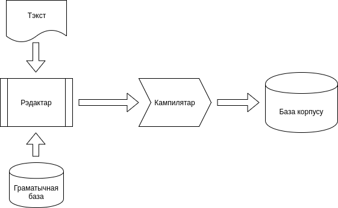
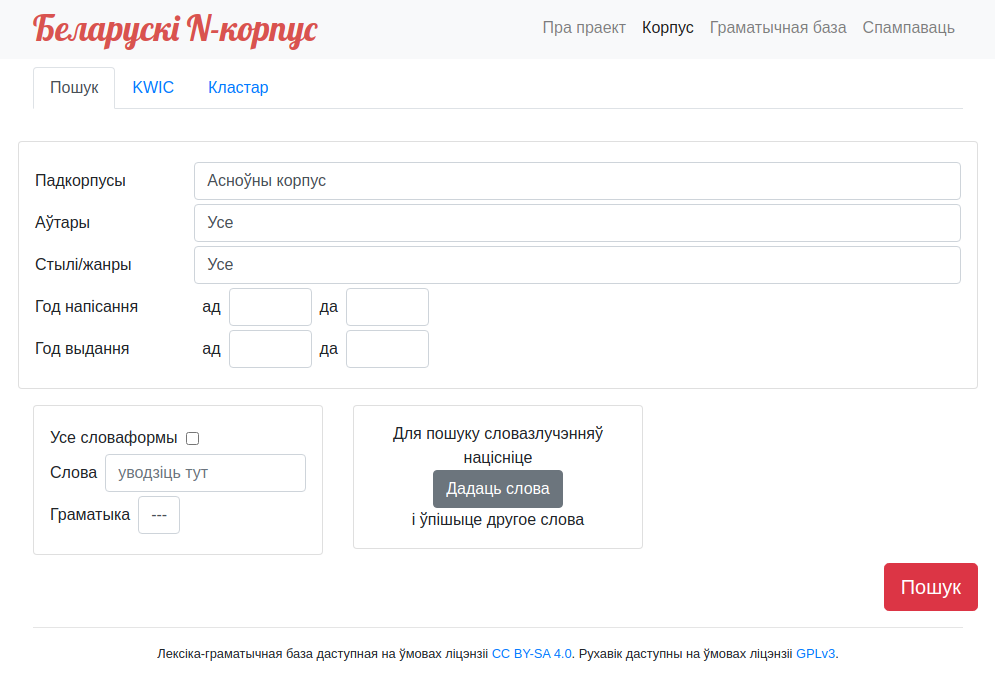
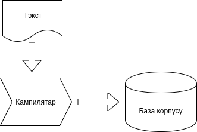
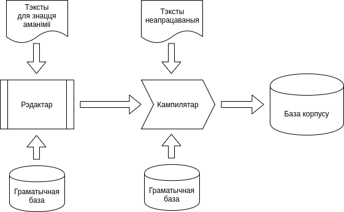
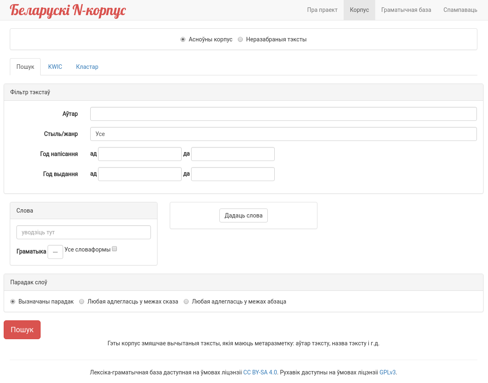

Korpus
======

“Korpus” is software for processing and viewing [text corpuses](https://en.wikipedia.org/wiki/Text_corpus), that contains several parts:

* Text editor (with grammar database editor)
* Compiler
* Search UI

Additional thing for processing is language-specific *Grammar database*. It contains all forms of all words of language with some grammar marks. It’s very useful, but not strictly required thing for corpus.
Texts should be prepared for use they in Search UI.

The best, but most slowly, process of preparing text will looks like:

Texts for corpus should be prepared as simple text files with some passport info at the beginning of file. After that, somebody should use *Editor* for mark texts: choose specific word for each homonym in text, add new words into Grammar database, etc. Each word of text will contain link to Grammar database at the end of editing. Text after editing stored in XML.
*Compiler* should process all marked texts for create *Corpus database*. *Search UI* will use *Corpus database* for display info.
Choosing right word for homonyms via *Editor* increases quality of corpus, but requires much time since each text should be processed manually.

Not so best, but faster process of texts preparing can looks like:

Since user don’t need to process each text manually, it dramatically decreases time of corpus preparing. Drawbacks: user will see all homonyms in texts even if he will choose some grammar marks.
But creating grammar database for you language will also require enough big time.

Most faster process of texts preparing can looks like:

This variant of preparation doesn’t require grammar database at all. Drawbacks: user will not be able to find all forms of word, but corpus will still be useful since search with ‘\*’ will work. For example, user can find ‘animal\*’ for view ‘animal’ and ‘animals’ forms. It will be useful especially  for languages without declension.

Actually, *Korpus* can combine all these 3 variants of text processing. Compiler can process all kind of words together: marked words without homonyms, non-marked words with automatic processing via grammar database, and unknown words that not exists in grammar database. Thereby, real process of prepare texts can looks like:

With this combined process, text corpus can be improved step-by-step. You can add new texts, create grammar database and mark texts for removing homonyms independently.

Editor
------
Editor is just Java+SwingUI program, i.e. usual program for local execution. It will be wrong way to create web-based software for that, since only few peoples will use this software, and they will require fastest and useful complex interface for editing.

Compiler
--------
Compiler is Java program that only administrator will use. Goal of compiler is to read grammar database, read marked and unmarked texts, and prepare read-only database for Search UI.
[Apache Lucene](https://lucene.apache.org/) is used for corpus database. Opposite to usual SQL databases(PostgreSQL, Oracle, MariaDB, etc.), Lucene was created for store information with variable size of attributes for each object(count of words in paragraph will be differ for each paragraph, and count of grammar marks for each word will be differ for each word).

Search UI
---------

Requirements for *Search UI* are different -- it should be accessible via Internet. Search UI is standard Java Web application with Angular+Bootstrap libraries. Search UI requires Grammar database and precompiled corpus database that created by *Compiler*.
Requests from users can be much complex that simple search of specific word, i.e. complex that Lucene database can support. That’s why “two-pass” search is required: first pass is just search by specific words or grammar marks, then second pass checks more complex rules in found paragraphs.

Speed
-----
Architecture of corpus software brings high performance of data preparation and search.
Belarusian corpus(with ~155 million words) requires only ~15 minutes for compilation using Intel i7-4770 processor.
Lucene is a java embedded library, that means full search works in the one java process and don’t need to be transferred to other servers via network.

Free software -- GPLv3
----------------------
Corpus engine is distributed under GPLv3 free license. That means you can use and adopt it for your language and your requirements.

Adaptation for other languages
------------------------------
Corpus can be adopted for other languages enough simple and has different levels of adaptation:
1. Just define list of letters for your language.
2. Define grammar marks for each part of speech for your language and create grammar database for all words in your language.
